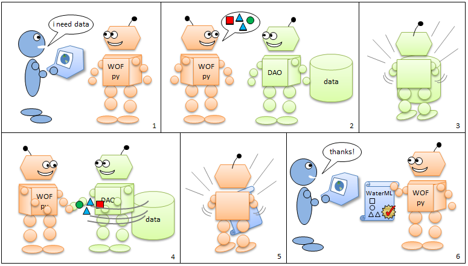

.. index::
   single: tutorial, CSV DAO
   single: CSV DAO tutorial

**********************************************
Creating a DAO for Comma Delimited (CSV) Files
**********************************************

Introduction
============

This tutorial demonstrates how to build a DAO (Data Access Objects) for comma
delimited (CSV) files, enabling WOFpy to publish data stored in CSV format.
This tutorial starts with a look at the end result.  The tutorial then gives an
overview of the solution before going into hands-on training in writing your
own DAO.

This tutorial requires WOFpy to be installed on your computer
(https://github.com/swtools/WOFpy/). 

A Python code editor or IDE would be useful since you'll be viewing Python
files.  When the tutorial asks you to open a Python file, you should open the
file for editing in your code editor.  Do not actually execute the code.  When
it's time to execute code, the tutorial will instruct you to run the
appropriate command.

The tutorial assumes you are familiar with Python and have read WOFpy
documentation on its architecture including the function of DAOs.  

Viewing the Result
==================

Let's view the end result to see what it is that you're trying to achieve in
this tutorial.  First let's take a look at the data, which are contained in
CSV files.

.. note::
   All tutorial files are located in the **WOFpy/examples/csv_tutorial**
   folder.

1. Open the **solution** folder.  

2. Open **data.csv** and **sites.csv**.

These files contain data values and site descriptions, respectively.  The data
values include daily average values for river stage (i.e., the height of the
river) in feet and discharge (i.e., how much water is flowing in the river) in
cubic feet per second. The data are for three sites in Texas along the Colorado
River and belong to a fictitious organization called Texas River Monitoring,
whose monitoring program ran from January 1, 2008, to April 30, 2008.  The data
are further described in metadata.txt

3. Close **data.csv** and **sites.csv**.

Now let's view the data in WaterML by running our own WOFpy service application.

4. Open a command window to the **solution** folder.

5. Enter this command: ``python runserver_csv.py``

The **runserver_csv.py** file has a few lines of code to start the WOFpy
service application using the CSV DAO for data access. You've now got a live
WaterOneFlow service running on your computer!

6. Open a Web browser and navigate to http://127.0.0.1:5000.  

This page has links to WaterML outputs for some example queries.  

7. Click on the first link that begins with **GetValues**.  

The XML response is WaterML with information about the queried site and
variable, followed by the time series values of the variable.  The data values
should match the values in your data.csv file.  Note the additional metadata
returned in the WaterML beyond what is provided in the CSV files.  Since others
don't know the unique qualities of your data, this metadata is required for
others to properly interpret your data.  

8. In the command window, press **CTRL+C** to stop the service. 

Now that you've seen the result of WOFpy serving the data from CSV files, let's
look into the magic in the middle that enabled this result.

How It Works
============

Here's a colorful illustration showing how WOFpy and your DAO team up to
deliver data to the user.

   Figure 1. WOFpy and DAO work as a team.  1) The user asks WOFpy for data.
   2) WOFpy interprets the request as a set of required fundamental objects
   (sites, units of measure, etc.) and asks the DAO to supply those objects.
   3) The DAO uses relevant data from its database to create the requested
   objects.  4) The DAO delivers the objects to WOFpy.  5) WOFpy translates the
   objects into WaterML.  6) WOFpy delivers WaterML to the user.
   
The DAO really has it easy.  It just gives some simple objects to WOFpy when
WOFpy asks for them, and then lets WOFpy handle creating WaterML from those
objects while supporting both SOAP and REST endpoints.  

WOFpy expects two things from a DAO:

* The DAO has the same method signatures found in **wof.dao.BaseDao**.  
* The DAO methods return objects or lists of objects found in **wof.models**.

Let's take a look at those core WOFpy files.

1. In the **WOFpy/wof** folder (where you downloaded WOFpy), open **dao.py**.

This file has a single class, **BaseDao**, with definitions for all methods
that WOFpy expects of a DAO.  For example, **BaseDao.get_site_by_code**
includes a **site_code** parameter which should uniquely identify a site within
your observation network, and the method should return an object representing
that site.  In other words, it's like WOFpy is saying, "Please give me a site
object that matches this description."  This is represented by the callout in
panel 2 of the figure above.  Any time WOFpy needs data from your DAO, it will
use one of these methods to ask for it.

Notice that **BaseDao** raises **NotImplementedError** for all methods.  It's a
good idea to derive your DAO class from **BaseDao** because this error will
remind you about any methods that you forgot to implement.

If the callout in panel 2 represents methods from **BaseDao**, then the shapes
in panel 4 represent the classes in **models.py**.  These are the objects
returned by methods in **BaseDao**.  Let's take a look at those classes.

2. Open **models.py**.

The first few items are basically controlled vocabularies.  For example, if you
need to describe the sample medium in which your measurements are taken, then
you should consider using a term from **SampleMediumTypes**.  This helps data
publishers use consistent terminology when describing their data, which in turn
helps data consumers more easily understand the data.

The remaining items are classes representing the building blocks of a fully
described dataset.  For example, **BaseVariable** has properties describing a
variable such as name, sample medium, and units of measure.  Notice that
**VariableUnits** is a **BaseUnits** object.  Similarly, the **BaseSeries**
class (which describes a time series) includes building blocks of **BaseSite**,
**BaseVariable**, **BaseMethod**, and **BaseSource**.  

The classes in **models.py** are based primarily on entities in the CUAHSI
`Observations Data Model (ODM) <http://his.cuahsi.org/odmdatabases.html>`_.
See the design specifications of ODM for an excellent review of those entities.
Another great resource is the controlled vocabulary system on the CUAHSI-HIS
website at http://his.cuahsi.org/mastercvreg/cv11.aspx. The controlled
vocabularies provide suggested terms to use when describing your data.  

Some of the key objects in the conceptual model behind WOFpy and ODM are:

* **Site** - The location of a time series.  Key properties include Name,
  Latitude, and Longitude.  Sites are usually associated with one or more time
  series variables.
* **Variable** - The property represented by a time series, e.g.,
  precipitation.
* **Method** - The method used to measure a variable.
* **Source** - The organization responsible for collecting the data.
* **Series** - A description of a time series, including site, variable,
  period of record, and number of values.
* **DataValue** - A single time series value, including the value itself, the
  date and time at which it was measured, and the quality control level of the data.

Now that you've seen these core components, let's take a peek at how the CSV
DAO implements them.

3. In the **solution** folder, open **csv_model.py**.

This module imports **wof.models** and then defines classes that inherit from
classes in **wof.models**.  Notice how the module defines a class such as
**Variable** and specifies the values of some of **BaseVariable's** properties.
In this case, the purpose of **csv_model** is to fill out some of the properties
that will always be the same for the data in our CSV files, while leaving the
remaining properties to be filled out by the DAO.  For example, because all of
our site locations are in Texas, we can hard code the **State** property of
**Site**.  But since we have several site locations, we won't hard code
**Latitude** and **Longitude**.  This streamlines the programming for the DAO
since it doesn't have to worry about these hard-coded properties.  The DAO will
set the remaining properties in response to which site WOFpy asks for at
runtime.  

Notice that not all classes in **wof.models** are represented here.  Classes
for which no properties can be hard coded and classes which do not apply to our
dataset (such as measurement offset) can be left out.  

By the way, the use of your own 'models' module is optional. It was used in
this CSV example because many properties for classes in **wof.models** could be
specified at design time.  In cases where you are using an object relational
mapper such as SQLAlchemy to connect to a database, your 'models' module would
be a good place to put your data mappings (see the ODM example included with
WOFpy).  But ultimately, WOFpy only sees your DAO, so it's up to you to decide
how many supporting classes, if any, you want to include in your solution.

Now let's look at the DAO itself.

4. In the **solution** folder, open **csv_dao.py**.

The first thing we notice are several import statements.  These include
utilities for working with time (timedelta, dateutil.parser), WOFpy (wof.dao,
wof.models, csv_model), and CSV files (csv).  Then we get to the definition of
CsvDao, which inherits from BaseDao.

In the initializer for **CsvDao**, we take note of the CSV files storing the
sites and data values that this DAO will be working with.  Then we create a
dictionary to store objects representing the variables in our dataset, namely
river stage and discharge.

.. note::
   In a real application you'd probably want to store these variable
   descriptions in a separate CSV file.  They are hard-coded in this tutorial
   to demonstrate the various options you have for building your DAO.
   
The remainder of the class includes methods defined by **BaseDao** and
supporting methods.  For example, let's examine **get_site_by_code**, whose
purpose is to return a site object given the site's identifier.  **CsvDao**
implements this method by opening the sites CSV file, skipping the header,
finding the row that matches the given **site_code**, creating a site object
from that row, and then returning the site object.

You can take a detailed look at **CsvDao** later.  At that time, some key
points to note are:

* Be mindful of how datetimes are represented in your dataset.  WaterML
  datetimes use a format defined by the ISO 8601 standard including offset from
  Universal Time Coordinates (UTC).  Methods like **CsvDao.parse_date_strings**
  help the DAO to work with datetimes that are time zone aware.  Your DAO
  should return either time zone aware datetimes or strings formatted according
  to the ISO 8601 standard.
* Note how **get_datavalues** checks that the given **site_code** and
  **var_code** are valid before parsing the lengthy data values file.
* Since this dataset has no data qualifiers or offsets, the methods related to
  those items return empty lists.  Nice and easy.
  
Finally, let's see how WOFpy gets connected to CsvDao.

5. Open **runserver_csv.py**.

This module is responsible for creating the Web application for the
WaterOneFlow service.  The file **csv_config.cfg** includes some default
parameters for the service.  The module creates the DAO and points it to the
site and data values CSV files, and then it creates the WaterOneFlow
application and supplies it with the DAO and the configuration file location.
As long as **CsvDao** implements the methods in **BaseDao**, it should work
fine with WOFpy.  When the application runs, it prints a brief message showing
how to access the service.

6. Close all of the Python files that you have opened.

Now that you've seen the big picture and the critical details, you may be ready
to start writing your own DAO.  But for those with an insatiable desire for
hands-on training, the next section walks you through the implementation of one
method from **BaseDao**.

Creating Your Own DAO
=====================

For some hands-on training in building a DAO, let's create a **CsvDao** that
implements **get_sites_by_codes**.

1. Navigate to the **tutorial** folder.

Here you find many of the same files as in the solution.  The DAO and model
files are missing.  You will create those files (at least to support
**get_sites_by_codes**) in this tutorial.

2. Create and open a file named **csv_dao.py**.

We know we'll be working with CSV files.  Luckily, Python includes a **csv**
module for that purpose. We also know that our DAO needs to implement methods
in **BaseDao**, so we'll import **BaseDao** and inherit from it.  

3. Add the following import statements::

    import csv
    from wof.dao import BaseDao

Now we'll create the DAO class definition.  We'll call the class **CsvDao**,
and it will inherit from **BaseDao**.  The class will include an initializer in
which the path to the CSV file defining site locations is provided.  We'll
store that path as an attribute of the class.

4. Create the DAO class definition and its initializer::

    class CsvDao(BaseDao):
        def __init__(self, sites_file_path):
            self.sites_file_path = sites_file_path

Let's create some code to test our DAO.  Rather than having to start WOFpy just
for testing, you should be able to execute the following code directly from
your code editor.  (If not, then consider using an editor such as IDLE.)

5. Add the following code to the bottom of the file::

    if __name__ == '__main__':
        import os
        current_folder = os.getcwd()
        path = os.path.join(current_folder, 'sites.csv')

        dao = CsvDao(path)
        sites = dao.get_sites_by_codes(['Austin'])
        s = sites[0]

        print s.SiteName
        print s.State
        print s.Latitude
        print s.Longitude
        print s.LatLongDatum.SRSName

The ``if __name__ == '__main__':`` block is executed when the script is run as
a standalone program.  The first three lines within the block are for getting
the location of sites.csv, which should be in the same folder as csv_dao.  

Then, the DAO is created by supplying the path to the CSV file.  Next, the DAO
is asked to provide a list of site objects that match a list of site codes.  A
single site code, Austin, is provided in the list.  Then, we make a reference
to the first site object returned (there should be only one in this example).

Finally, various properties of the site are printed to the console.

6. Save the file and run the code.

When you run the code, you will see a **NotImplementedError**.  That's because
we haven't written **get_sites_by_codes** yet!  But now we have a quick and
easy way of testing our DAO.

.. note::
   When the interpreter didn't see **get_sites_by_codes** in **CsvDao**, it
   passed the request to **CsvDao's** base class, **BaseDao**.  It was
   **BaseDao** that returned the **NotImplementedError**.  Otherwise, an
   **AttributeError** would have been raised.  Seeing the
   **NotImplementedError** lets us know that we're on the right track!
   
It's time to implement **get_sites_by_codes**.  We can look at the code in
**BaseDao** for the method definition.  Since we know the method should return
a list of site objects, we'll create a list and make sure we return the list at
the end of the method.

7. Add the following code to the CsvDao class after the __init__ method::

    def get_sites_by_codes(self, site_codes_arr):
        sites = []
        return sites

8. Save the file and run the code.

This time, we get an **IndexError**.  This is because there are no sites in our
returned site list.  It is just an empty list.  We need to look through each
row in the CSV file to find sites that match any of the site codes in the input
**site_codes_arr** list.  The first column in the CSV file (with the header
name 'Site') is the column representing site codes.  Once we've found a
matching row, we need to create a site object from that row.  We'll use a
separate method called **create_site_from_row** for that, which we'll add
later.

9. Add the following code after the creation of the empty sites list and before
   the sites list is returned by **get_sites_by_codes**::
   
        with open(self.sites_file_path, 'rb') as f:
            reader = csv.reader(f)
            at_header = True
            for row in reader:
                if at_header:
                    at_header = False
                    continue
                
                if row[0] in site_codes_arr:
                    site = self.create_site_from_row(row)
                    sites.append(site)

This code uses a ``with`` statement to ensure that the CSV file is properly
closed when we're finished with it.  It creates a CSV reader which loops
through each row in the CSV file, splitting a given row into an array using
commas as delimiters.  Because our CSV file includes a header row, the first
row is skipped.  If the first column in a given row matches a site code from
the input list of site codes, then we create a site object from that row and
add it to the output site list.

If you run the code now, you'll get an **AttributeError** because
**create_site_from_row** doesn't exist.  Before we create that method, now is a
good time to look at the0 **BaseSite** class from **wof.models**.  We can see
that some properties such as **State** will be the same for all sites in our
example. Therefore, let's create our own **Site** class derived from
**BaseSite**, in which we hard code some properties common to all sites.  We'll
do this in a separate file called csv_model.

10. Create and open a file named **csv_model.py**.

11. Add the following code to **csv_model.py**::

        import wof.models as wof_base

        class Site(wof_base.BaseSite):
            LatLongDatum = wof_base.BaseSpatialReference()
            LatLongDatum.SRSID = 4269 # EPSG code
            LatLongDatum.SRSName = 'NAD83'
            State = 'Texas'

This code imports **wof.models** and defines a class named **Site** derived
from **wof.models.BaseSite**.  The **State** property is hard coded to Texas.
Because all sites use the same datum (NAD83) as indicated in metadata.txt, the
**LatLongDatum** property is also hard coded.  Note that **BaseSite** defines
the datum as a **BaseSpatialReference** object, so this object is created and a
couple of its properties are set to represent the NAD83 datum.

12. Save **csv_model.py**.

13. At the top of **csv_dao.py**, add an import statement below the other
    import statements to include the **csv_model** module that you just
    created::

        import csv_model

14. Add the following code to the **CsvDao** class to define the
    **create_site_from_row** method::
    
        def create_site_from_row(self, csv_row_items):
            site = csv_model.Site()
            site.SiteCode = csv_row_items[0]
            site.SiteName = csv_row_items[1]
            site.Latitude = csv_row_items[2]
            site.Longitude = csv_row_items[3]
            return site

This method receives a list representing a row from a CSV file.  It creates the
**Site** object defined in csv_model and then populates the remaining **Site**
properties by using values from the row in the CSV file.  Then it returns the
**Site** object.

At this point, you are finished writing code for this tutorial.  For reference,
you can find the code in :ref:`completed-csv-dao-tutorial-code`.

15. Save the file and run the code.

Your console should now show you the site name and other properties of the
site.  Hooray!  Now let's make sure WOFpy likes your DAO.

16. Open a command window to the **tutorial** folder.

17. Enter this command: ``python runserver_csv.py``

18. Open a Web browser and navigate to http://127.0.0.1:5000.  

19. Click on the second link, the one that reads
    **GetSites?site=TxRivers:Austin**.  

You should now be looking at WaterML representing the Austin site.  Yay!

20. Click **Back** in your browser.

21. Click any of the other links.

You should see **NotImplementedError** for the other links since you haven't
programmed those parts of your DAO.  

22. In the command window, press **CTRL+C** to stop the service. 

Congratulations!  You have completed the tutorial and have learned the basics
of how to create a DAO for WOFpy.  Please reference the files in the solution
folder of this tutorial or the examples included with WOFpy to see how methods
in the DAO are implemented for various dataset types.

.. _completed-csv-dao-tutorial-code:

Completed Tutorial Code
=======================

Below is the code for **csv_dao.py**::
    
    import csv
    from wof.dao import BaseDao
    import csv_model
    
    class CsvDao(BaseDao):
        def __init__(self, sites_file_path):
            self.sites_file_path = sites_file_path
    
        def create_site_from_row(self, csv_row_items):
            site = csv_model.Site()
            site.SiteCode = csv_row_items[0]
            site.SiteName = csv_row_items[1]
            site.Latitude = csv_row_items[2]
            site.Longitude = csv_row_items[3]
            return site
            
        def get_sites_by_codes(self, site_codes_arr):
            sites = []
            with open(self.sites_file_path, 'rb') as f:
                reader = csv.reader(f)
                at_header = True
                for row in reader:
                    if at_header:
                        at_header = False
                        continue
                    
                    if row[0] in site_codes_arr:
                        site = self.create_site_from_row(row)
                        sites.append(site)
            return sites
        
    if __name__ == '__main__':
        import os
        current_folder = os.getcwd()
        path = os.path.join(current_folder, 'sites.csv')
    
        dao = CsvDao(path)
        sites = dao.get_sites_by_codes(['Austin'])
        s = sites[0]

        print s.SiteName
        print s.State
        print s.Latitude
        print s.Longitude
        print s.LatLongDatum.SRSName

Below is the code for **csv_model.py**::

    import wof.models as wof_base

    class Site(wof_base.BaseSite):
        LatLongDatum = wof_base.BaseSpatialReference()
        LatLongDatum.SRSID = 4269 # EPSG code
        LatLongDatum.SRSName = 'NAD83'
        State = 'Texas'

